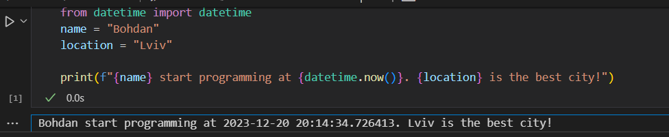
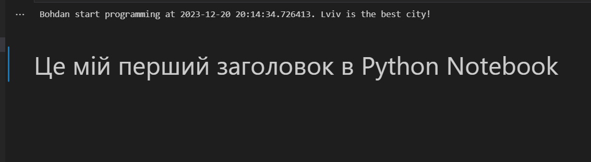

# Звіт до роботи
# Тема: Оформлення робіт та перша програма
# Мета роботи: Ознайомитись з способом оформлення робіт

# Виконання роботи

Програма my_first_app.py вивела це "Andriy start programming at 2023-12-20 20:12:29.310354. Ternopil is the best city!"
Програма my_first_app.ipynb видала такий же результат 

Я перевірив можливості python notebook зробивши заголовок  
З запуском програми мій заголовок не змінюється

Чат GPT видав ось такий текст та код відповідно 

Я, як штучний інтелект, не маю конкретної історії або здатності написання програм в традиційному розумінні, так як це роблять люди. Однак я можу генерувати код за вашим запитом, враховуючи знання, які я отримав до моєї дати обрізки (січень 2022 року). Якщо у вас є конкретна ідея або завдання, яке ви хочете, щоб я спробував створити код для нього, будь ласка, поділіться інформацією, і я допоможу вам згенерувати відповідний код.

Якщо ви хочете, щоб я "придумав" першу програму, яку б я можливо написав, ось приклад простої програми на Python, яку я можу згенерувати:
```python
# Програма для обчислення суми двох чисел

# Запитати користувача про введення першого числа
num1 = float(input("Введіть перше число: "))

# Запитати користувача про введення другого числа
num2 = float(input("Введіть друге число: "))

# Обчислити суму двох чисел
sum_result = num1 + num2

# Вивести результат
print(f"Сума {num1} і {num2} дорівнює {sum_result}")
```