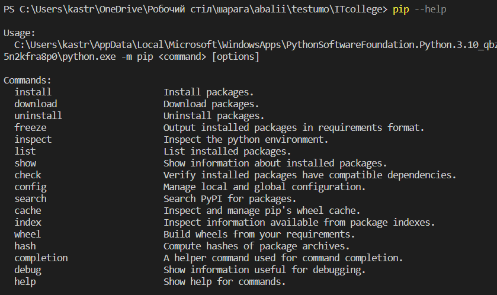
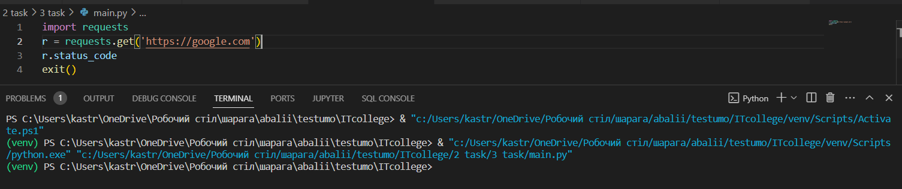
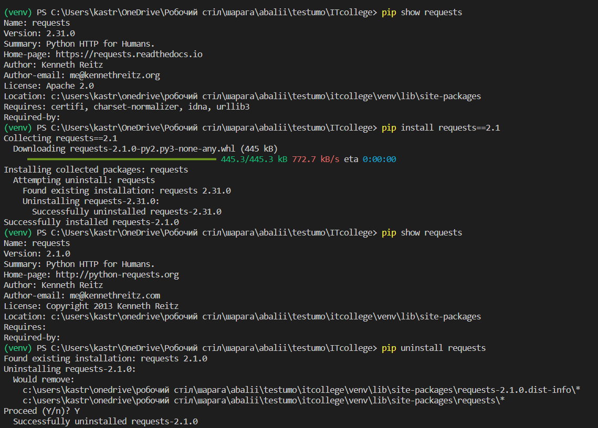
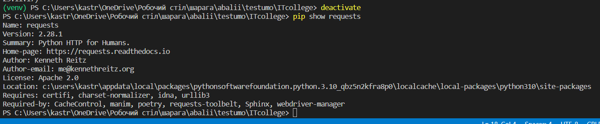
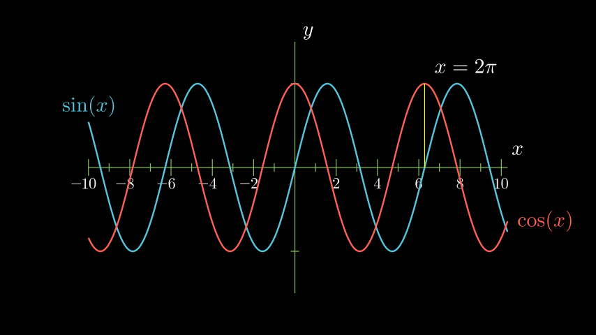
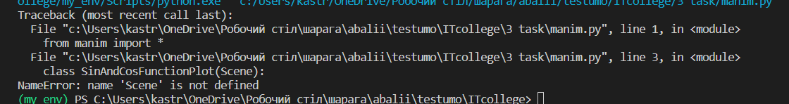

# Звіт до роботи
# Тема: Основи Python
# Мета роботи: Ознайомитись з основними конструкціями в Python

# Виконання роботи

Я встановив PIP на свій пристрій та перевірив що я можу виконати з ним


### 4 наданий код нічого не вивів


### 5 команда нижче вивела мені вихідний код сторінки microsoft.com
```python
headers = {'User-Agent': 'my-app/1.0'}
response = requests.get('https://microsoft.com', headers=headers)
print(response.text)
```

### 6 

## Робота у віртуальному середовищі

 Ця команда використовується для відображення деталей про встановлені пакети.
 
 Я помістив віртуальні середовище в файл .gitignore, тому вони не будуть відображатись у репозиторії
##### venv/
##### my_env/

### Робота з Pipenv
за допомогою pipenv можна виконувати такі команди pipenv install ... -- команда використовується для встановлення пакетів, pipenv --rm -- видалення віртуального середовища, pipenv graph -- перегляд залежностей

Я обрав бібліотеку manin та інсталював її. Після чого написав код з використанням функцій та методів цієї бібліотеки
```python
from manim import *

class SinAndCosFunctionPlot(Scene):
    def construct(self):
        axes = Axes(
            x_range=[-10, 10.3, 1],
            y_range=[-1.5, 1.5, 1],
            x_length=10,
            axis_config={"color": GREEN},
            x_axis_config={
                "numbers_to_include": np.arange(-10, 10.01, 2),
                "numbers_with_elongated_ticks": np.arange(-10, 10.01, 2),
            },
            tips=False,
        )
        axes_labels = axes.get_axis_labels()
        sin_graph = axes.plot(lambda x: np.sin(x), color=BLUE)
        cos_graph = axes.plot(lambda x: np.cos(x), color=RED)

        sin_label = axes.get_graph_label(
            sin_graph, "\\sin(x)", x_val=-10, direction=UP / 2
        )
        cos_label = axes.get_graph_label(cos_graph, label="\\cos(x)")

        vert_line = axes.get_vertical_line(
            axes.i2gp(TAU, cos_graph), color=YELLOW, line_func=Line
        )
        line_label = axes.get_graph_label(
            cos_graph, "x=2\pi", x_val=TAU, direction=UR, color=WHITE
        )

        plot = VGroup(axes, sin_graph, cos_graph, vert_line)
        labels = VGroup(axes_labels, sin_label, cos_label, line_label)
        self.add(plot, labels)
        ```
даний код видає ось таке математичне зображення. 

Змінивши інтерпритатор моя програма перестала працювати 

### додаткове завдання Flask

Я розробив ось таку веб-сторінку яка містить інформацію про те, що це моя перша сторінка та дещо про нетфлікс
Для цього в кореневій папці я створив файл app.py 
```python
from flask import Flask, render_template

app = Flask(__name__)

@app.route('/')
def index():
    # Ваш код програми, який ви хочете вивести на веб-сторінці
    output = "Привіт, це мій перший веб-сайт з використанням Flask!"
    return render_template('index.html', output=output)

if __name__ == '__main__':
    app.run(debug=True)
```

потім в кореневій папці я зробив папку templates та в неї помістив index.html
```html
<!-- templates/index.html -->

<!DOCTYPE html>
<html lang="en">
<head>
    <meta charset="UTF-8">
    <meta name="viewport" content="width=device-width, initial-scale=1.0">
    <title>Мій перший веб-сайт</title>
    <link rel="stylesheet" href="{{ url_for('static', filename='style.css') }}">
</head>
<body>
    <div class="container">
        <h1>Вивід програми на веб-сторінці</h1>
        <p>{{ output }}</p>

        <section class="netflix-section">
            <h2>Netflix</h2>
            <p>Netflix - це популярна платформа для стрімінгу відео контенту.</p>
        </section>

        <section class="netflix-originals-section">
            <h2>Netflix Originals</h2>
            <p>Netflix Originals - унікальний контент, який доступний тільки на Netflix.</p>
        </section>

        <section class="netflix-movies-section">
            <h2>Netflix Movies</h2>
            <p>Великий вибір фільмів для перегляду на Netflix.</p>
        </section>
    </div>
</body>
</html>
```

на останок я додав стилі створивши папку static та в ній додав файл style.css 
```css
/* static/style.css */

body {
    font-family: 'Arial', sans-serif;
    background-color: #f4f4f4;
    margin: 0;
    padding: 0;
}

.container {
    max-width: 800px;
    margin: 0 auto;
    padding: 20px;
    background-color: #fff;
    box-shadow: 0 0 10px rgba(0, 0, 0, 0.1);
}

h1 {
    color: #333;
}

p {
    color: #666;
}

.netflix-section,
.netflix-originals-section,
.netflix-movies-section {
    margin-top: 30px;
}

h2 {
    color: #e50914; /* Червоний колір Netflix */
}

.netflix-section p,
.netflix-originals-section p,
.netflix-movies-section p {
    color: #333;
}
```

# Висновок
❓ Що зроблено в роботі:
Встановлено PIP, виведено код на сторінці, взаємодія з Microsoft сайтом, вивчено віртуальне середовище, використано Pipenv, розроблено анімацію на Manim, створено веб-сайт з використанням Flask.

❓ Чи досягнуто мети роботи:
Так, мета роботи досягнута - ознайомлення з основними конструкціями в Python та робота з віртуальним середовищем.

❓ Які нові знання отримано:
Отримано знання про PIP, віртуальні середовища, бібліотеку requests, Pipenv, Manim, створення веб-сайту на Flask, роботу з HTML і CSS.

❓ Чи вдалось відповісти на всі питання задані в ході роботи:
Так, всі питання отримали відповіді.

❓ Чи вдалося виконати всі завдання:
Не зовсім, я не зміг виконати декількох завдань з Pipenv

❓ Чи виникли складності у виконанні завдання:
Були труднощі із зміною інтерпретатора. 

❓ Чи подобається такий формат здачі роботи (Feedback):
Мені до вподоби

❓ Побажання для покращення (Suggestions):
Мені варто більше попрактикувати роботу у віртуальному середовищі
